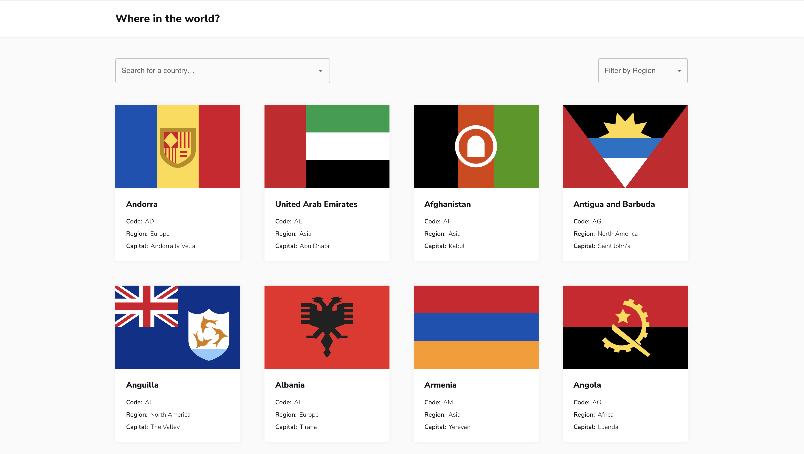

# Frontend Mentor - The Countries web app displays main information about a country based on the Countries GraphQL API

This is a solution to
the [Countries web app challenge on Frontend Mentor](https://www.frontendmentor.io/challenges/rest-countries-api-with-color-theme-switcher-5cacc469fec04111f7b848ca).
Frontend Mentor challenges help you improve your coding skills by building realistic projects.

### The challenge

Users should be able to:

- See all countries from the API on the homepage
- Search for a country using an `input` field
- Filter countries by region
- Click on a country to see more detailed information on a separate page

### Preview

### Links

- Live Site URL: [Demo](https://countries-app-theta-five.vercel.app)

### Built with

- React
- React Router
- Typescript
- Apollo Client
- GraphQL
- Vite
- Eslint
- Prettier
- MUI (Material-UI)

## Author

- Website - [nagornykh.me](https://nagornykh.me/)
- Frontend Mentor - [@Ex-Zy](https://www.frontendmentor.io/profile/Ex-Zy)
